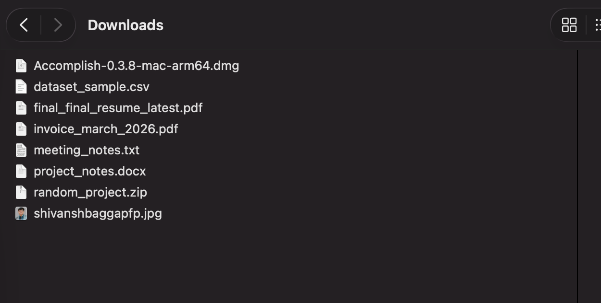

# CleanDesk

## Overview

CleanDesk is an AI powered file organization concept built using Accomplish, an open source desktop AI desktop agent. The goal is to automatically organize digital files so users spend less time searching renaming and cleaning folders. The system focuses on practical productivity through structured digital workspaces while keeping data local and under user control.

## Problem Statement

Modern computer systems accumulate files quickly. Screenshots documents installers datasets media files and project assets often mix together in one folder. Over time this causes lost productivity duplicate downloads and difficulty locating important files. Manual organization rarely happens consistently which creates ongoing digital clutter.

An intelligent automation layer that understands file purpose and organizes content safely can reduce this friction.

## Solution Approach

CleanDesk uses an AI agent running locally through Accomplish to analyze files understand context and suggest organization actions. The system proposes folder categorization clearer file names and structured placement while allowing user approval before execution.

The emphasis is privacy first automation transparency of actions and gradual workflow improvement.

## Core Features

### Automatic File Categorization

Files are classified into simple categories such as documents images archives code installers and media based on file type and contextual understanding.

### Intelligent File Renaming

File names are rewritten into clear human readable titles reflecting file purpose without unnecessary complexity.

### Folder Structure Creation

The system creates logical folders based on usage patterns and maintains consistent organization over time.

### Preview Before Execution

All suggested actions are shown before execution to ensure safety and user confidence.

### Local First Design

All analysis and automation run locally through Accomplish with user controlled access permissions.

## Architecture Overview

User File Folder
↓
Accomplish Desktop Agent
↓
Local or External AI Model
↓
Classification Logic
↓
Safe File Rename And Move Execution

This design keeps data local while enabling AI assisted decision making.

## Example Workflow

1 User downloads files normally
2 CleanDesk scans selected folders periodically
3 Files are classified by purpose using AI reasoning and file metadata
4 Clear file names are suggested
5 Folder structure is proposed based on content type
6 User reviews preview of actions
7 Approved actions are executed safely

## Technology Stack

Accomplish open source desktop automation agent
Local AI models through Ollama or external providers
File system monitoring automation layer
Optional lightweight desktop interface

## Screenshots

### Accomplish UI Model

### Downloads Folder Before Cleanup

### Accomplish Automation Output

## Future Scope

Duplicate file detection improvements
Context aware folder intelligence based on projects
Periodic summary reports of organized files
Integration with cloud storage systems
Optional dashboard for productivity insights

## Project Status

Concept validation stage with prototype experiments using Accomplish local AI automation. Development currently focused on workflow validation prompt refinement and safe automation design.

## Author

Shivansh Bagga
